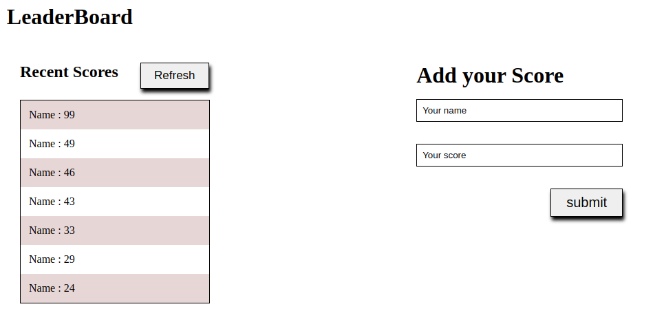

# Leaderboard

> It is a simple website where user submit their name and score that gets preserved in the external API and then gets displayed on the screen



## Built With

- Html
- CSS
- Javascript

## Live Demo (if available)

-Not yet deployed


## Getting Started

To get a local copy up and running follow these simple example steps.
```
git clone  https://github.com/tonnymuchui/Leaderboard
```
```
git checkout -b basic-page
```
```
git pull origin basic-page
```

```
npm run start
```

### Prerequisites

```
No PREREQUISTIES NEEDED
```

### Setup
- If it suits you, on your local computer, create a directory in your preferred location (e.g in the Desktop or Document directory)

### Usage
- You can view the HTML document in your preferred or default browser.
### Run tests

### Deployment


## Authors

👤 **Author1**

- GitHub: [@githubhandle](https://github.com/tonnymuchui)
- Twitter: [@twitterhandle](https://twitter.com/tonnymuchui2)
- LinkedIn: [LinkedIn](https://www.linkedin.com/in/tonny-muchui-murungi-9b549a174/)

## 🤝 Contributing

Contributions, issues, and feature requests are welcome!

Feel free to check the [issues page](../../issues/).

## Show your support

Give a ⭐️ if you like this project!

## Acknowledgments

- Hat tip to anyone whose code was used
- Inspiration
- etc

## 📝 License

This project is [MIT](./MIT.md) licensed.
